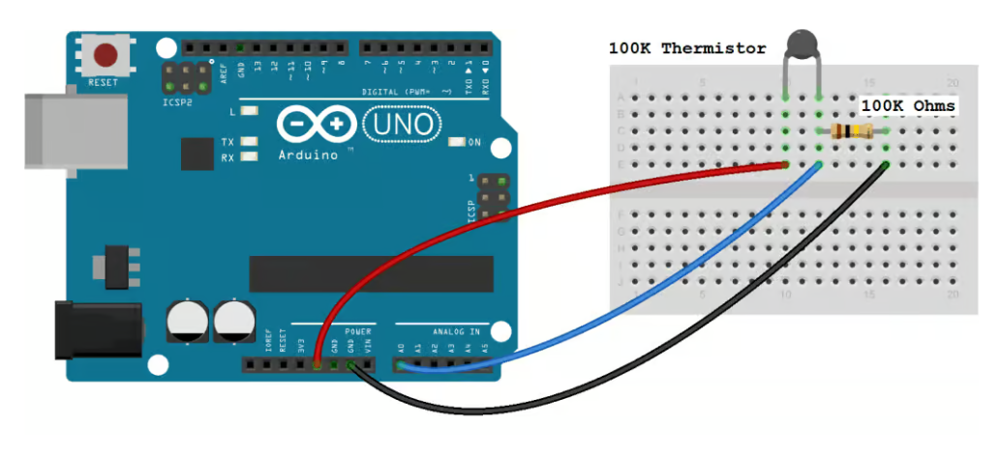
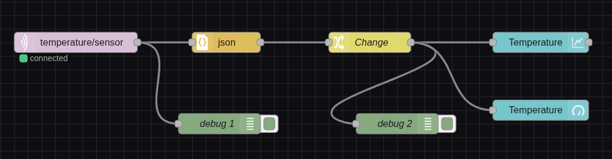
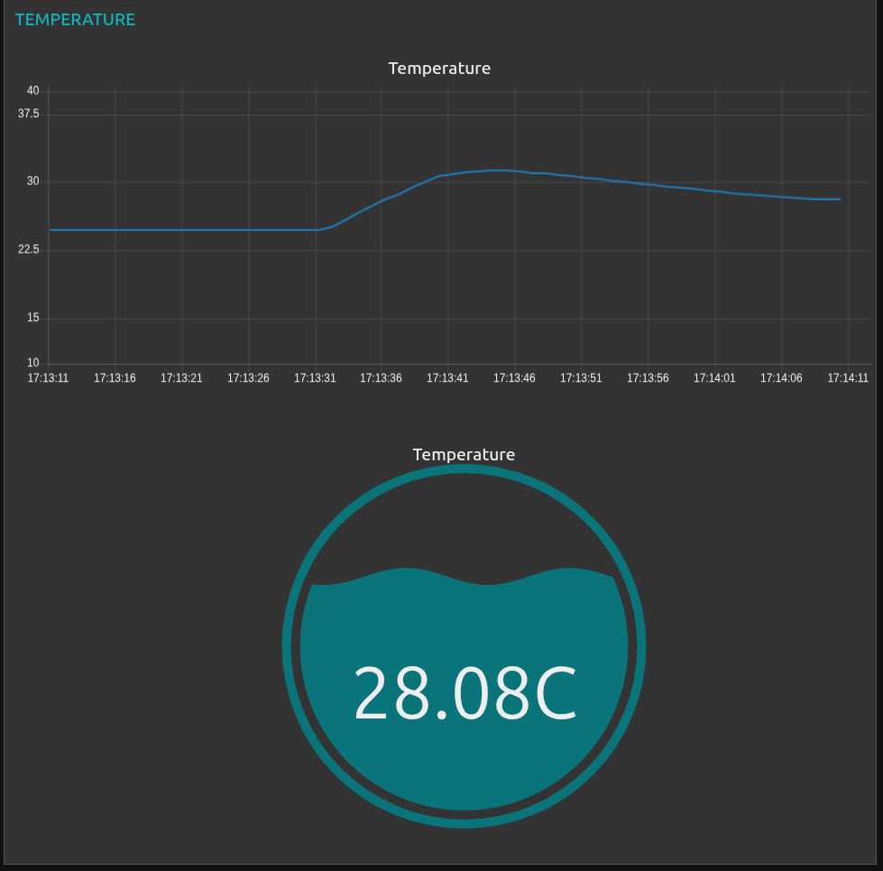

# Real-Time Temperature Monitoring System


A real-time temperature monitoring system built with **Arduino** and **Python**. It collects environmental data using a thermistor, sends the readings to a computer over a serial connection, processes and distributes the data in real time using **MQTT**, stores the history in a **MongoDB** database, and displays the information on a live **dashboard** built with **Node-RED**.

## Table of Contents

- [Objective](#objective)
- [How It Works](#how-it-works)
- [Required Hardware](#required-hardware)
- [Circuit Assembly](#circuit-assembly)
- [Software and Libraries](#software-and-libraries)
- [Installation and Setup](#installation-and-setup)
- [Usage](#usage)
- [Node-RED Flow](#node-red-flow)
- [Dashboard](#dashboard)
- [Project Structure](#project-structure)
- [Troubleshooting](#troubleshooting)
- [Next Steps](#next-steps)
- [Contributing](#contributing)
- [License](#license)

## Objective

Develop a temperature monitoring system using Arduino and Python. The system collects data from the environment through a thermistor, sends the readings to the computer via serial communication, and allows real-time visualization of the data.

This project serves as a foundation for future features, such as historical data storage and a more complete real-time dashboard.

## How It Works

1. The **thermistor** connected to the Arduino measures the ambient temperature through variations in resistance.
2. The **Arduino Uno** reads the analog value from the thermistor and sends the reading to the computer via **serial communication (USB)**.
3. A **Python** script reads the data from the serial port, parses/processes the information, and publishes it to an **MQTT broker (Mosquitto)**.
4. The readings are also stored in a **MongoDB** database for querying and historical tracking.
5. **Node-RED** subscribes to the MQTT topic (`temperature/sensor`), processes the JSON message, and displays the temperature in real time on a **dashboard** with a chart and a gauge.

## Required Hardware

- Arduino Uno
- 100K Thermistor
- 100K Ohm resistor
- USB cable
- Jumper wires
- Breadboard

## Circuit Assembly



The thermistor and resistor form a voltage divider:

- One leg of the thermistor connects to **5V** (red wire).
- The other leg connects to the **100K resistor** and to the Arduino's **A0** analog input (blue wire).
- The other end of the resistor connects to **GND** (black wire).

## Software and Libraries

Built with **Python**, using the following libraries:

- `json` — data serialization/deserialization
- `paho.mqtt.client` — communication with the MQTT broker
- `serial` — reading data from the Arduino's serial port
- `re` — text processing (regular expressions)
- `datetime` — timestamping the readings
- `pymongo` — integration with MongoDB

### Tools and Services

| Component | Technology |
|---|---|
| Database | MongoDB |
| Dashboard | Node-RED |
| Real-time communication | Mosquitto (MQTT) |

## Installation and Setup

### Prerequisites

- [Arduino IDE](https://www.arduino.cc/en/software)
- Python 3.x
- [Mosquitto MQTT broker](https://mosquitto.org/download/)
- [MongoDB](https://www.mongodb.com/try/download/community)
- [Node-RED](https://nodered.org/docs/getting-started/installation)

### 1. Upload the Arduino sketch

Open the sketch in the Arduino IDE, select the correct board and port, and upload it to the Arduino Uno.

### 2. Install Python dependencies

```bash
pip install pyserial paho-mqtt pymongo
```

### 3. Start the MQTT broker

```bash
mosquitto -v
```

### 4. Start MongoDB

Make sure your local (or remote) MongoDB instance is running and accessible.

### 5. Run the Python script

```bash
python publisher.py
```

Adjust the serial port (e.g. `COM3` on Windows or `/dev/ttyUSB0` on Linux) and the MQTT/MongoDB connection settings inside the script as needed.

### 6. Import the Node-RED flow

Open Node-RED, go to **Menu > Import**, and load the flow file included in this repository. Deploy the flow to start receiving data.

## Usage

1. Connect the Arduino to your computer via USB.
2. Run the Python script to start reading the serial data and publishing it to MQTT.
3. Open the Node-RED dashboard in your browser (default: `http://localhost:1880/ui`) to view the temperature in real time.

## Node-RED Flow



The flow consists of the following nodes:

1. **temperature/sensor** — MQTT in node, subscribed to the topic where the temperature is published.
2. **json** — converts the incoming message (string) into a JSON object.
3. **Change** — processes/formats the value before displaying it.
4. **Temperature (chart)** — displays the temperature trend over time.
5. **Temperature (gauge)** — displays the current temperature reading in real time.
6. **debug 1 / debug 2** — debug nodes used to inspect the messages at each stage of the flow.

## Dashboard



The dashboard displays:

- A **line chart** showing the temperature trend over time.
- A **circular gauge** showing the most recent temperature reading in °C.

## Project Structure

```
.
├── arduino/
│   └── monitor     
      └── monitor.ino    # Arduino sketch
├── python/
│   └── mongoDB.py
│   └── publisher.py     # Reads data and publish
│   └── serial_reader.py
│   └── subscriber.py    # Store data in mongoDB               
├── node-red/
│   └── flows.json
│   └── package.json                # Node-RED dashboard flow
├── images/
│   ├── circuit-diagram.png
│   ├── node-red-flow.png
│   └── dashboard.png
└── README.md
```

> Adjust this structure to match your actual repository layout.

## Troubleshooting

- **Serial port not found / permission denied**: check that the correct port is set in the Python script and that no other program (like the Arduino IDE Serial Monitor) is using it.
- **No data on the dashboard**: confirm the Mosquitto broker is running and that the topic name in Node-RED matches the one used in the Python script.
- **MongoDB connection error**: verify the MongoDB service is running and the connection string is correct.

## Next Steps

- Use ESP32.
- Expand the dashboard with alerts and additional metrics.
- Add support for other sensors (humidity, light, etc.).

## Contributing

Contributions are welcome. Feel free to open an issue or submit a pull request.

